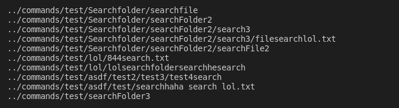
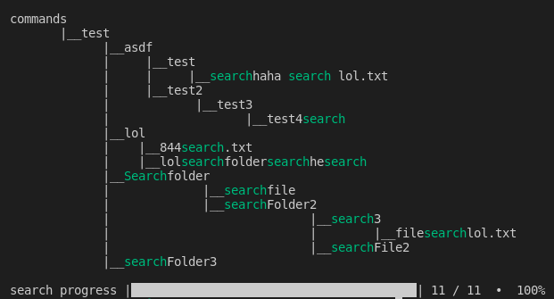

# find(pretty)p

this JavaScript based script is intended to beautify find in linux (also windows but not 100% supported)

the traditional output from the find command in linux is:

searching for "search"



and this is how findp works

```
findp [keyword] [path]
```



in a brief findp merges find and tree together but in JavaScript!

## make script global
to execute the findp command globally execute install.sh
```shell
sudo ./install.sh
```